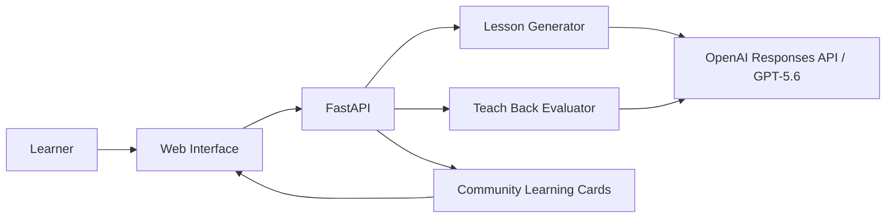

# Architecture

## Core objects

### Lesson
- topic and learner level
- explanation and analogy
- key ideas
- Mermaid diagram
- experiment and starter code
- quiz
- Teach Back prompt

### Teach Back evaluation
- mastery score
- verdict
- strengths
- gaps or misconceptions
- improved explanation
- next challenge

### Community Learning Card
- lesson
- learner's voluntary explanation
- evaluation
- future social metadata such as forks and likes
