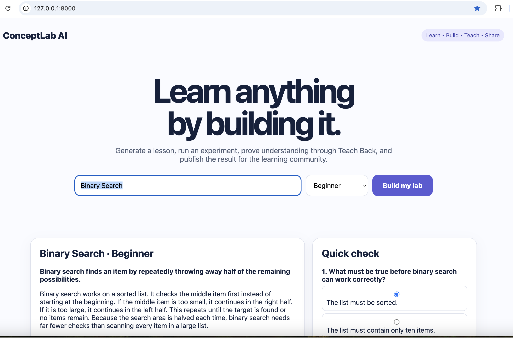
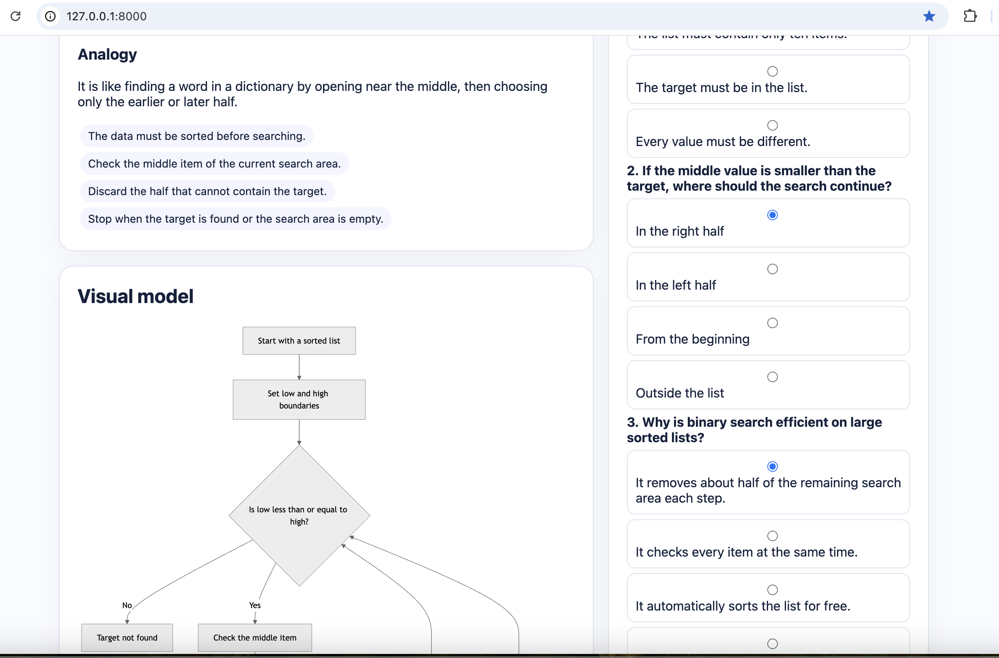
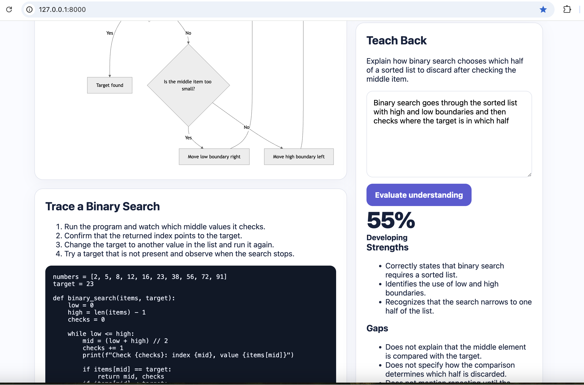
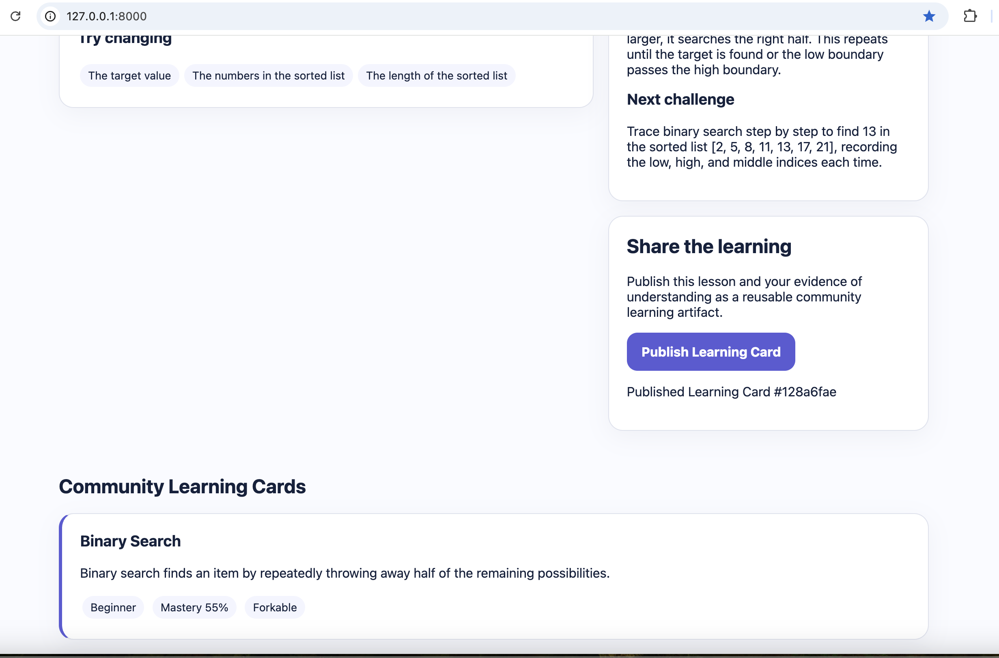

# ConceptLab AI

**Learn by Building. Teach by Sharing.**

ConceptLab AI is an AI-powered collaborative learning platform. A learner enters
a topic and receives a compact learning lab containing an explanation, analogy,
Mermaid visualization, runnable experiment, and quiz. The learner then uses
**Teach Back** to explain the concept in their own words. GPT-5.6 evaluates the
explanation for accuracy, missing ideas, and misconceptions. Finally, the learner
can publish the lesson and evidence of understanding as a reusable community
Learning Card.

## Product Preview

### AI Learning Lab



### Diagram



### Teach Back Evaluation



### Community Learning Cards



## Why it is different

Most AI tutors end after answering a question. ConceptLab AI closes the learning
loop:

**Learn → Build → Test → Teach Back → Share**

Each private AI interaction can become a reusable learning artifact that helps
future learners.

## Build Week track

**Education**

## Working MVP features

- Generate a personalized lesson using GPT-5.6
- Produce a Mermaid concept diagram
- Generate a safe, runnable Python experiment
- Create and grade a three-question quiz
- Evaluate a learner's Teach Back response
- Publish a community Learning Card
- View published cards in a lightweight community feed

## Technology

- FastAPI
- Vanilla HTML/CSS/JavaScript for a fast, portable demo
- OpenAI Python SDK
- OpenAI Responses API
- GPT-5.6
- Mermaid

## Run locally

Python 3.9+ is supported.

```bash
git clone https://github.com/babifarah9/conceptlab-ai.git
cd conceptlab-ai

python3 -m venv .venv
source .venv/bin/activate        # Windows: .venv\Scripts\activate
pip install -r requirements.txt

cp .env.example .env
# Put your OpenAI API key in .env

uvicorn app:app --reload
```

Open `http://127.0.0.1:8000`.

## Demo path

1. Enter **Binary Search**.
2. Generate the learning lab.
3. Show the explanation, Mermaid diagram, and Python experiment.
4. Answer the quiz.
5. Explain binary search in the Teach Back box.
6. Show GPT-5.6's mastery evaluation.
7. Publish the Learning Card.
8. Show it in the community feed.

## How GPT-5.6 is used

GPT-5.6 powers the two intelligence-critical stages:

1. **Learning-lab generation:** pedagogical explanation, analogy, key ideas,
   diagram, experiment, and formative quiz.
2. **Teach Back evaluation:** mastery scoring, misconception detection,
   corrective explanation, and next challenge.

The application uses the OpenAI Responses API through the official Python SDK.

## How Codex accelerated development

Codex was used as an active engineering agent rather than only an autocomplete
tool. It helped:

- translate the product concept into a working FastAPI architecture;
- implement API routes and the browser interface;
- design structured model prompts and defensive JSON parsing;
- connect the UI to lesson generation and Teach Back evaluation;
- identify error states and improve the end-to-end demo path;
- produce setup documentation and testable acceptance criteria.

### Key human decisions

The core product decisions remained human-directed:

- focusing on **Teach Back** as evidence of understanding;
- turning completed sessions into community Learning Cards;
- keeping the MVP to one complete learning loop;
- using transparent diagrams and runnable experiments rather than passive text;
- requiring learner consent through an explicit Publish action.

## Privacy and safety

- Publishing is explicit; learning content is not shared automatically.
- The MVP does not require personal or health data.
- Generated code is instructed to be short, offline, deterministic, and safe.
- AI mastery feedback is formative and is not presented as an accredited grade.
- Production versions should add authentication, moderation, persistent storage,
  abuse controls, and educator review workflows.

## Current MVP limitations

- Community cards are stored in memory and reset when the server restarts.
- The browser displays generated code but does not execute arbitrary code.
- Authentication, comments, likes, and forking are represented as the next
  product iteration.

## Suggested next steps

- PostgreSQL persistence and user accounts
- Lesson forking and version history
- Code sandbox with strict isolation
- Teacher-created rubrics
- Multimodal Teach Back through voice and diagrams
- Learning graph with prerequisites and mastery history

## License

MIT License. See [LICENSE](LICENSE).
